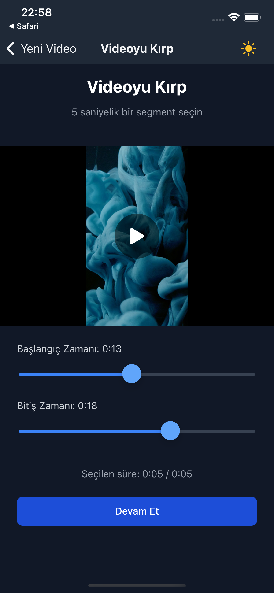
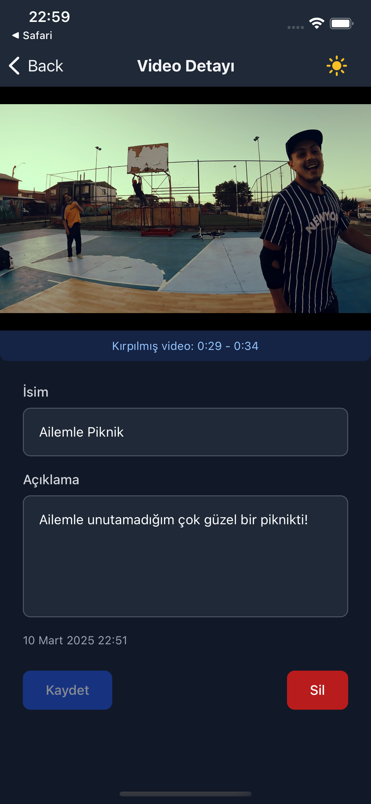

# Video Günlüğüm


## 📱 Uygulama Hakkında

Video Günlüğüm, kişisel video anılarınızı düzenlemek, kategorize etmek ve saklamak için tasarlanmış modern bir mobil uygulamadır. Özel anlarınızı kaydetmek, düzenlemek ve istediğiniz zaman tekrar izlemek için mükemmel bir çözüm sunar.

## ✨ Özellikler

- 🎥 **Video Seçme ve Kırpma**: Galerinizden video seçin ve en önemli anları kırparak kaydedin
- 🏷️ **Kategorilere Ayırma**: Videolarınızı aile, arkadaşlar, seyahat gibi kategorilere ayırın
- 🔍 **Arama ve Filtreleme**: İsim veya kategoriye göre videolarınızı hızlıca bulun
- 🌓 **Karanlık/Aydınlık Tema**: Göz yorgunluğunu azaltmak için tema desteği
- 📤 **Paylaşım Seçenekleri**: Videolarınızı sevdiklerinizle kolayca paylaşın
- 💾 **Yerel Depolama**: Tüm verileriniz cihazınızda güvenle saklanır

## 🛠️ Teknolojiler

- [React Native](https://reactnative.dev/) - Çapraz platform mobil uygulama geliştirme
- [Expo](https://expo.dev/) - React Native geliştirme araçları
- [TypeScript](https://www.typescriptlang.org/) - Tip güvenliği
- [NativeWind](https://www.nativewind.dev/) - Tailwind CSS benzeri stil sistemi
- [Zustand](https://github.com/pmndrs/zustand) - Durum yönetimi
- [React Hook Form](https://react-hook-form.com/) - Form yönetimi
- [Zod](https://github.com/colinhacks/zod) - Veri doğrulama
- [Expo Router](https://docs.expo.dev/routing/introduction/) - Navigasyon
- [Reanimated](https://docs.swmansion.com/react-native-reanimated/) - Animasyonlar

## 📸 Ekran Görüntüleri

<div style="display: flex; flex-wrap: wrap; gap: 10px; justify-content: center;">
  
  
  
  
</div>

## 🚀 Başlangıç

### Gereksinimler

- Node.js (v14 veya üzeri)
- npm veya yarn
- iOS için Xcode (macOS)
- Android için Android Studio

### Kurulum

1. Repoyu klonlayın:
   ```bash
   git clone https://github.com/sweoguzhan/diary-app.git
   ```

2. Bağımlılıkları yükleyin:
   ```bash
   npm install
   # veya
   yarn install
   ```

3. Uygulamayı başlatın:
   ```bash
   npx expo start
   ```

4. Expo Go uygulamasını kullanarak QR kodu tarayın veya bir emülatör/simülatör başlatın.

## 📋 Yapılacaklar

- [ ] Video kırpma için FFmpeg entegrasyonu
- [ ] Çoklu dil desteği

## 🤝 Katkıda Bulunma

Katkılarınızı memnuniyetle karşılıyoruz! Lütfen:

1. Bu repoyu forklayın
2. Yeni bir özellik dalı oluşturun (`git checkout -b yeni-ozellik`)
3. Değişikliklerinizi commit edin (`git commit -m 'Yeni özellik: Açıklama'`)
4. Dalınıza push yapın (`git push origin yeni-ozellik`)
5. Bir Pull Request açın

## 📞 İletişim

Sorularınız veya geri bildirimleriniz için [ogcengel@gmail.com](mailto:ogcengel@gmail.com) adresine e-posta gönderebilirsiniz.

---

⭐️ Bu projeyi beğendiyseniz, yıldız vermeyi unutmayın! ⭐️
