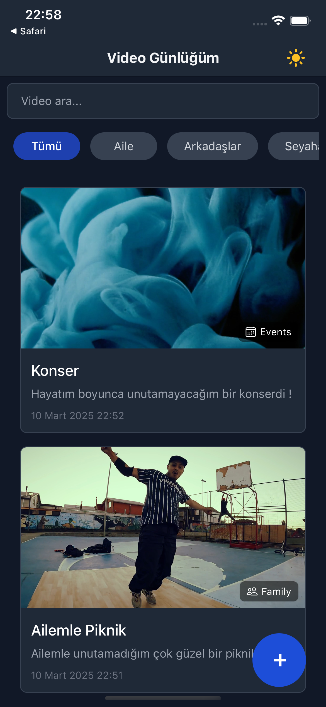
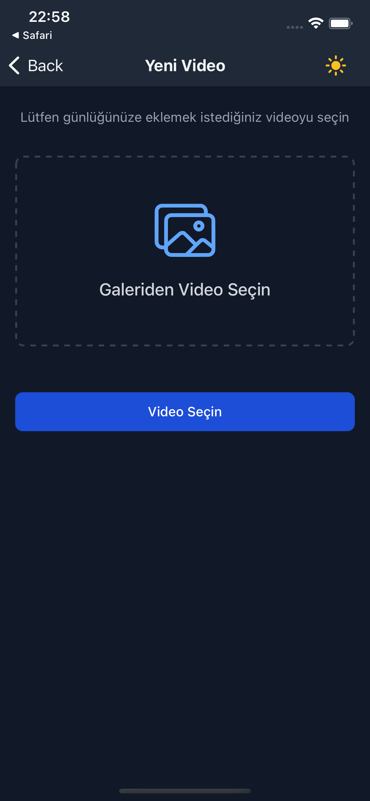

# Video Günlüğüm

## 📱 Uygulama Hakkında

Video Günlüğüm, kişisel video anılarınızı düzenlemek, kategorize etmek ve saklamak için tasarlanmış modern bir mobil uygulamadır. Özel anlarınızı kaydetmek, düzenlemek ve istediğiniz zaman tekrar izlemek için mükemmel bir çözüm sunar.

## ✨ Özellikler

- 🎥 **Video Seçme ve Kırpma**: Galerinizden video seçin ve en önemli anları kırparak kaydedin
- 🏷️ **Kategorilere Ayırma**: Videolarınızı aile, arkadaşlar, seyahat gibi kategorilere ayırın
- 🔍 **Arama ve Filtreleme**: İsim veya kategoriye göre videolarınızı hızlıca bulun
- 🌓 **Karanlık/Aydınlık Tema**: Göz yorgunluğunu azaltmak için tema desteği
- 💾 **Yerel Depolama**: Tüm verileriniz cihazınızda güvenle saklanır
- 🚀 **Performans Optimizasyonları**: Hızlı ve akıcı kullanıcı deneyimi

## 🛠️ Teknolojiler

- [React Native](https://reactnative.dev/) - Çapraz platform mobil uygulama geliştirme
- [Expo](https://expo.dev/) - React Native geliştirme araçları
- [TypeScript](https://www.typescriptlang.org/) - Tip güvenliği
- [NativeWind](https://www.nativewind.dev/) - Tailwind CSS benzeri stil sistemi
- [Zustand](https://github.com/pmndrs/zustand) - Durum yönetimi
- [Tanstack Query](https://tanstack.com/query) - Asenkron veri yönetimi
- [React Hook Form](https://react-hook-form.com/) - Form yönetimi
- [Zod](https://github.com/colinhacks/zod) - Veri doğrulama
- [Expo Router](https://docs.expo.dev/routing/introduction/) - Navigasyon
- [Reanimated](https://docs.swmansion.com/react-native-reanimated/) - Animasyonlar
- [FFmpeg](https://ffmpeg.org/) - Video işleme (simülasyon modunda)


## 📸 Ekran Görüntüleri

<div style="display: flex; flex-wrap: wrap; gap: 10px; justify-content: center;">
  
  
  
  
</div>
## 🚀 Başlangıç

### Gereksinimler

- Node.js (v14 veya üzeri)
- npm veya yarn
- Expo CLI
- iOS veya Android simülatörü (isteğe bağlı)

### Kurulum

1. Repoyu klonlayın:
   ```bash
   git clone https://github.com/sweoguzhan/diary-app.git
   cd diary-app
   ```

2. Bağımlılıkları yükleyin:
   ```bash
   npm install
   # veya
   yarn install
   ```

3. Uygulamayı başlatın:
   ```bash
   npx expo start --clean
   ```

4. Expo Go ile çalıştırmak için:
   - Terminal'de `s` tuşuna basın
   - Telefonunuzda Expo Go uygulamasını açın ve QR kodu tarayın
   - veya iOS/Android simülatöründe açmak için sırasıyla `i` veya `a` tuşlarına basın

## 📱 Kullanım

1. **Ana Sayfa**: Tüm kaydedilmiş videolarınızı görüntüleyin, kategorilere göre filtreleyin veya arama yapın.

2. **Video Ekleme**:
   - Sağ alt köşedeki "+" butonuna tıklayın
   - Galeriden bir video seçin
   - Video kırpma ekranında 5 saniyelik bir segment belirleyin
   - Video bilgilerini (isim, açıklama, kategori) girin ve kaydedin

3. **Video Detayları**:
   - Listedeki bir videoya tıklayarak detaylarını görüntüleyin
   - Bilgileri düzenleyin veya videoyu silin